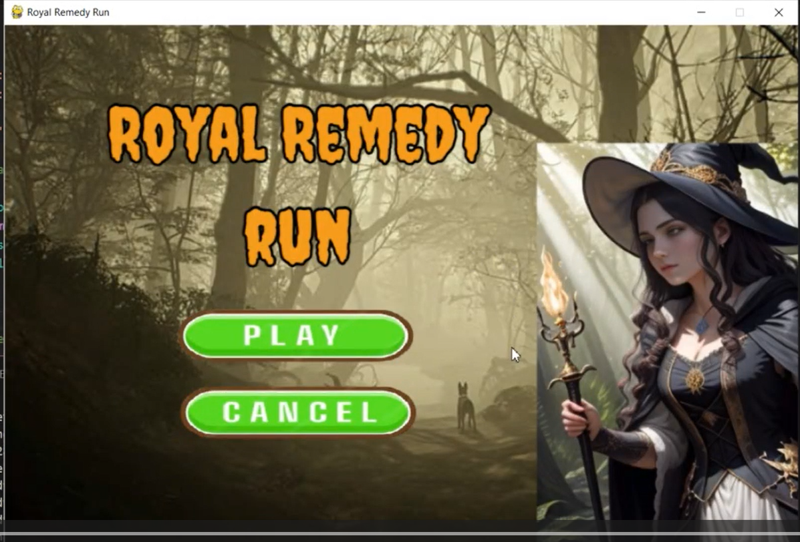
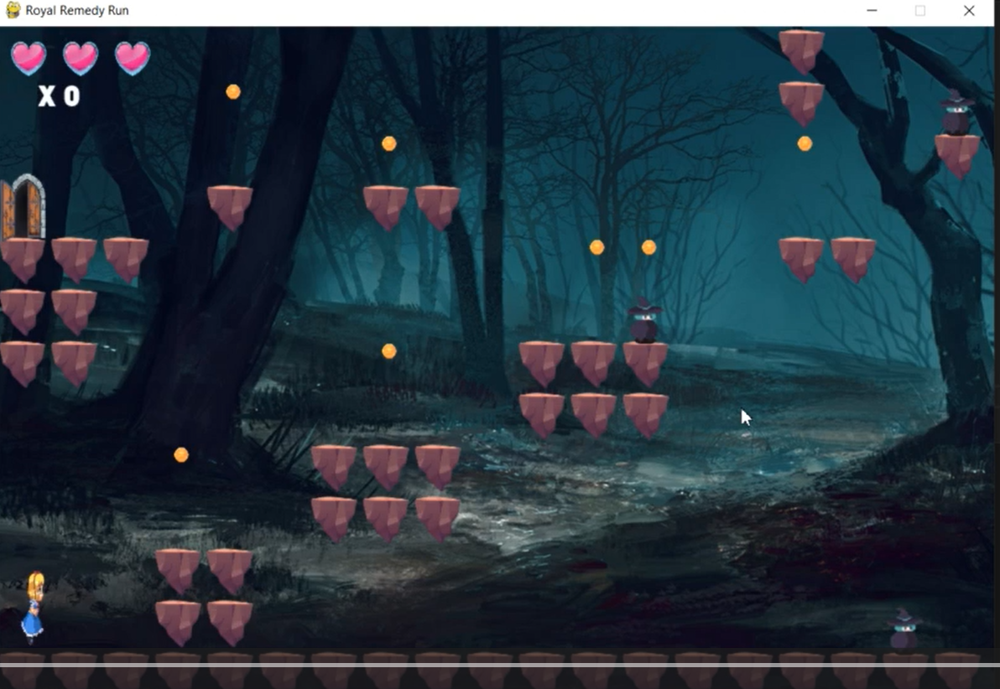
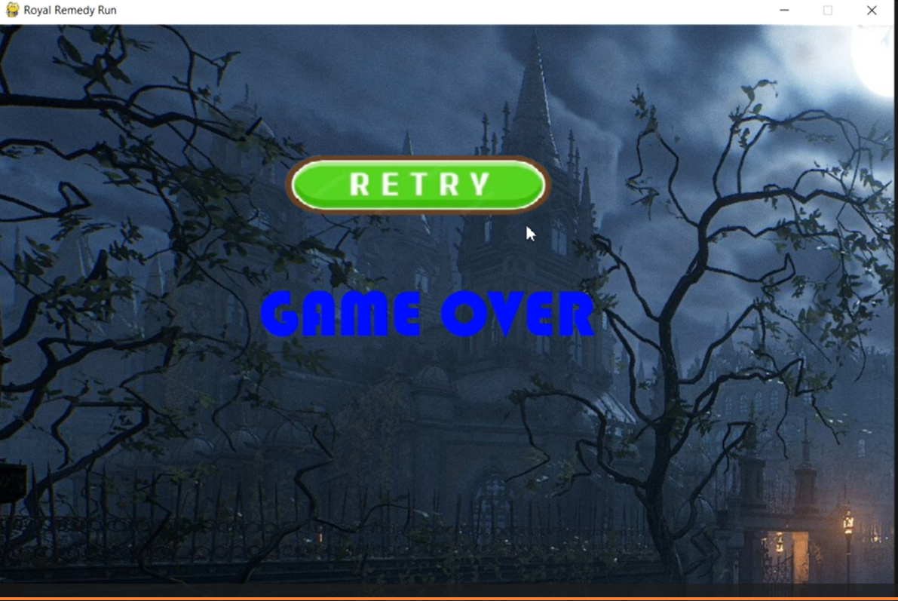

# Royal Remedy Run

A 2D platformer game built with **Python** and **Pygame** where you play as a princess navigating through 4 challenging levels filled with enemies, lava traps, and collectible coins — all in search of the Royal Remedy!

---

## 🎮 Gameplay Preview

> _(Add your screenshots here — drag and drop images into the GitHub README editor)_

| Main Menu                          | In Game                             | Game Over                              |
| ---------------------------------- | ----------------------------------- | -------------------------------------- |
|  |  |  |

---

## 🕹️ Controls

| Key             | Action     |
| --------------- | ---------- |
| `→` Right Arrow | Move right |
| `←` Left Arrow  | Move left  |
| `Space`         | Jump       |

---

## 🌍 Game Overview

- **4 unique levels**, each with its own background and increasing difficulty
- **3 lives** — lose a life when hitting an enemy or falling in lava
- **Coins** to collect and track your score
- **Gate** at the end of each level to advance to the next
- **Royal Remedy** collectible at the final level — find it to win the game!

---

## 🗺️ Level Design

Levels are built with a tile grid system. Each level file contains a 2D array:

| Tile Code | Object                               |
| --------- | ------------------------------------ |
| `1`       | Land / Platform                      |
| `2`       | Enemy                                |
| `3`       | Lava                                 |
| `4`       | Coin                                 |
| `5`       | Gate (levels 1–3) / Remedy (level 4) |
| `6`       | Remedy item                          |

---

## 📁 Project Structure

```
Royal-Remedy-Run/
├── assets/
│   ├── images/
│   │   ├── g0.png – g3.png           # Player animation frames
│   │   ├── ws1.png – ws5.png         # Enemy animation frames
│   │   ├── dead.png                  # Player death sprite
│   │   ├── land.png                  # Platform tile
│   │   ├── lava.png                  # Lava tile
│   │   ├── coin.png                  # Coin sprite
│   │   ├── gate.png                  # Level exit gate
│   │   ├── remedy.png                # Royal Remedy collectible
│   │   ├── h1.png / h2.png / h3.png  # Heart UI (full / half / quarter)
│   │   ├── background1–4.png         # Level backgrounds
│   │   └── backgroundstart.png       # Main menu background
│   └── sounds/
│       ├── coin.wav                  # Coin pickup sound
│       ├── Jump Sound Effect.mp3     # Jump sound
│       ├── Game Over sound.mp3       # Game over sound
│       └── RPG Combat Music.mp3      # Background music
├── levels/
│   ├── level1.py                     # Level 1 tile map
│   ├── level2.py                     # Level 2 tile map
│   ├── level3.py                     # Level 3 tile map
│   └── level4.py                     # Level 4 tile map
├── main.py                           # Game entry point & main loop
├── player.py                         # Player class
├── enemy.py                          # Enemy class
├── button.py                         # UI Button class
├── globals.py                        # Shared game state variables
└── README.md
```

---

## ⚙️ Installation & Running

### 1. Clone the repository

```bash
git clone https://github.com/buyakawo/Royal-Remedy-Run.git
cd Royal-Remedy-Run
```

### 2. Install dependencies

```bash
pip install pygame
```

### 3. Run the game

```bash
python main.py
```

---

## 🧠 Code Architecture

**`globals.py`** — Shared game state accessible across all modules. Tracks `game_over` status (`0` = running, `-1` = game over, `1` = level complete), `player_lives`, and `max_level`.

**`main.py`** — Core game loop. Handles rendering, level loading via `importlib`, score tracking, background switching per level, and all game state transitions (menu → playing → game over → next level → win screen).

**`player.py`** — Manages the princess: keyboard input, gravity simulation, walking animation cycling, and collision detection with platforms, enemies, lava, coins, the gate, and the remedy.

**`enemy.py`** — Animated enemy sprite that cycles through 5 frames at a configurable speed. Triggers a life loss on contact with the player.

**`button.py`** — Reusable clickable UI button using mouse position and click state detection.

**`levels/level*.py`** — Each file exports a `level_data` 2D grid (13 rows × 19 columns) using tile codes.

---

## 🛠️ Built With

- [Python 3](https://www.python.org/)
- [Pygame](https://www.pygame.org/)

---

## 👩‍💻 Author

Made by [@buyakawo](https://github.com/buyakawo)

---

## 📄 License

This project is open source and available under the [MIT License](LICENSE).
